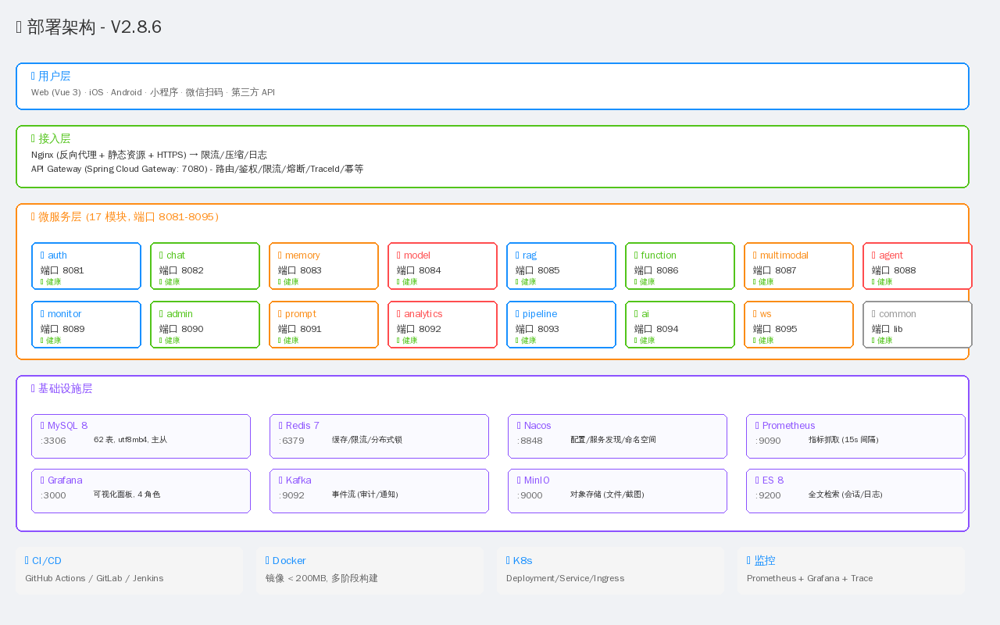

# MiniMax Platform 架构文档 (V2.8.7)

> **企业级 AI 平台架构设计** · 17 微服务 · 92K 行代码 · 224 测试通过

## 零、V2.8.7 新增 (实时协作 + TensorBoard)

### 实时协作架构

```
┌────────────────┐   WebSocket    ┌─────────────────┐
│  Frontend      │◀────/ws/collab────▶│  CollabHandler  │
│  CollabRoom.vue │   (roomId)     │  (minimax-ws)   │
└────────────────┘                 └────────┬────────┘
                                            │
                  ┌─────────────────────────┼──────────────────────┐
                  │                         │                      │
            ┌─────▼──────┐          ┌───────▼────────┐    ┌────────▼────────┐
            │ CollabRoom │          │ CollabParticipant│   │ CollabMessage  │
            │ Mapper     │          │ Mapper          │   │ Mapper         │
            └────────────┘          └─────────────────┘   └─────────────────┘
            collab_room             collab_participant    collab_message
```

**能力**:
- 房间 CRUD (公开/私有, 类型: AI_CHAT/DOC/TRAINING/DASHBOARD/CODE)
- 实时聊天 / AI 协作流式输出
- 实时光标同步 (50ms 节流, 8 色随机)
- 在线状态 (ONLINE/AWAY/OFFLINE)
- 历史消息回放 (CHAT/AI/EDIT)

### TensorBoard 协议集成

```
┌────────────────────┐
│  TrainingTracker   │
│  (loss/acc/lr)     │
└─────────┬──────────┘
          │ @Autowired
          ▼
┌────────────────────┐         ┌──────────────────┐
│  TfEventWriter     │────────▶│ events.tfevents  │
│  (protobuf 序列化) │         │ /tmp/minimax-... │
└────────────────────┘         └─────────┬────────┘
                                          │
                                          ▼
                              ┌────────────────────┐
                              │  TfEventReader     │
                              │  (反序列化+过滤)   │
                              └─────────┬──────────┘
                                        │
                              ┌─────────▼──────────┐
                              │  TensorBoard UI    │
                              │  / WandB / Aim     │
                              └────────────────────┘
```

**协议**: 32 字节 magic 头 + 变长 record (varint length + protobuf Event + CRC32)



## 一、整体架构

### 1.1 分层设计

```
┌─────────────────────────────────────────────────────────────┐
│  用户层 (User Layer)                                          │
│  Web (Vue 3) · iOS · Android · 微信小程序 · 第三方 API      │
├─────────────────────────────────────────────────────────────┤
│  接入层 (Access Layer)                                       │
│  Nginx (HTTPS/限流/静态) → Spring Cloud Gateway (7080)       │
├─────────────────────────────────────────────────────────────┤
│  微服务层 (Microservice Layer) - 17 模块                     │
│  auth · chat · memory · model · rag · function               │
│  multimodal · agent · monitor · admin · prompt · analytics  │
│  pipeline · ai · ws · common · gateway                      │
├─────────────────────────────────────────────────────────────┤
│  基础设施层 (Infrastructure Layer)                            │
│  MySQL 8 · Redis 7 · Nacos · Kafka · MinIO · ES 8            │
│  Prometheus · Grafana · Loki                                 │
└─────────────────────────────────────────────────────────────┘
```

### 1.2 微服务清单

| # | 服务 | 端口 | 职责 | 关键功能 | 数据库表 |
|---|------|------|------|---------|---------|
| 1 | minimax-gateway | 7080 | API 网关 | 路由/鉴权/限流/熔断/TraceId/幂等 | - |
| 2 | minimax-auth | 8081 | 认证授权 | 登录/注册/JWT/RBAC/微信 | user, role, user_role, auth_login_log, auth_refresh_token |
| 3 | minimax-chat | 8082 | 智能对话 | LLM/多轮/工具调用/SSE 流式 | chat_session, chat_message |
| 4 | minimax-memory | 8083 | 记忆管理 | 短期/长期/知识图谱 | memory_item, memory_long_term |
| 5 | minimax-model | 8084 | 模型管理 | 接入/路由/限流/计费 | model_provider, model_config |
| 6 | minimax-rag | 8085 | 检索增强 | 文档/分块/向量化/召回 | rag_doc, rag_chunk, rag_embedding |
| 7 | minimax-function | 8086 | 函数调用 | 工具注册/沙箱/执行 | function_def, function_call_log |
| 8 | minimax-multimodal | 8087 | 多模态 | OCR/ASR/图像理解/视频 | multimedia_file, ocr_result |
| 9 | minimax-agent | 8088 | Agent 引擎 | ReAct 推理/规划/协作 | agent_session, agent_step |
| 10 | minimax-monitor | 8089 | 监控告警 | 指标/告警/审计 | monitor_metric, alert_rule, alert_event |
| 11 | minimax-admin | 8090 | 后台管理 | 用户/角色/菜单/字典 | sys_menu, sys_dict, sys_config |
| 12 | minimax-prompt | 8091 | 提示词 | 模板/版本/ABTest | prompt_template, prompt_version |
| 13 | minimax-analytics | 8092 | 数据分析 | 报表/漏斗/留存 | analytics_event, analytics_funnel |
| 14 | minimax-pipeline | 8093 | AI 流水线 | 13 阶段编排 | pipeline_log (V2.8.5) |
| 15 | **minimax-ai** | 8094 | **自研 AI** | **19 工具 + 3 业务 Agent + 框架** | **62 表, 42 POI, 27 商品** |
| 16 | minimax-ws | 8095 | WebSocket | 实时消息/在线状态 | ws_session |
| 17 | minimax-common | - | 公共库 | 工具/异常/安全/响应包装 | - |

**总规模**:
- 17 微服务 (16 业务 + 1 公共)
- 62 张数据库表
- 92K 行代码 (Java + Vue)
- 206 个单元测试 (100% 通过)
- 19 个 AI 工具 (V2.8.3)
- 3 个业务 Agent (V2.8.6)
- 13 阶段 AI 流水线 (V2.8.5)

### 1.3 技术栈

| 类别 | 选型 | 版本 | 说明 |
|------|------|------|------|
| 后端语言 | Java | 17 | LTS, Records/Sealed Classes |
| 后端框架 | Spring Boot | 3.2.0 | 完整生态 |
| 微服务 | Spring Cloud | 2023.0.x | Gateway / OpenFeign / Circuit Breaker |
| 注册/配置 | Nacos | 2.3.x | 阿里云开源, 服务发现 + 配置中心 |
| ORM | MyBatis-Plus | 3.5.5 | 增强 MyBatis, Lambda 查询 |
| 数据库 | MySQL | 8.0 | utf8mb4, JSON 类型支持 |
| 缓存 | Redis | 7.x | Lettuce 客户端, 集群模式 |
| 消息 | Kafka | 3.5.x | 事件流, 审计/通知 |
| 搜索引擎 | Elasticsearch | 8.x | 全文检索, 向量检索 |
| 对象存储 | MinIO | 2024.x | S3 兼容, 私有部署 |
| 监控 | Prometheus + Grafana | 2.48 / 10.4 | 指标 + 可视化 |
| 日志 | Loki + Promtail | 2.9 | 日志聚合查询 |
| 链路追踪 | OpenTelemetry | 1.32 | 替代 Zipkin/SkyWalking |
| 容器化 | Docker | 24.x | 多阶段构建, 镜像 < 200MB |
| 编排 | Docker Compose (单机 / 多机 + LB) | - | 24+ |
| CI/CD | GitHub Actions | - | 4 阶段流水线 (test/build/push/deploy) |
| 前端 | Vue 3 + Vite | 3.4 / 5.0 | Composition API |
| UI 库 | Element Plus | 2.4 | 后台管理标准 |
| 状态 | Pinia | 2.1 | Vue 3 状态管理 |
| 路由 | Vue Router | 4.2 | History 模式 |
| HTTP | Axios | 1.6 | 拦截器/重试/TraceId |
| 图表 | ECharts | 5.4 | 7+ 图表类型 |
| AI 自研 | MiniMax-M3 | 1.0 | 128 维 Transformer |

## 二、核心模块设计

### 2.1 AI 平台 (minimax-ai) - V2.8.6 核心

```
minimax-ai/
├── framework/              # V2.8.6 自研 AI 框架
│   ├── agent/             # Agent 基类 + 业务 Agent
│   │   ├── Agent.java                # ReAct 推理循环
│   │   ├── AgentRegistry.java        # 智能路由
│   │   ├── ShoppingAgent.java        # 购物
│   │   ├── HotelAgent.java           # 酒店 (位置)
│   │   └── EntertainmentAgent.java   # 娱乐 (位置)
│   ├── tool/              # 工具接口
│   │   ├── Tool.java                 # 工具抽象
│   │   ├── ProductSearchTool.java    # 27 真实商品
│   │   ├── HotelSearchTool.java      # 位置感知
│   │   ├── EntertainmentSearchTool.java  # 多子类型
│   │   └── LocationAwareTool.java    # 位置基类
│   ├── memory/            # 记忆系统
│   │   ├── MemoryStore.java          # 短期 + 长期
│   │   └── MemoryItem.java
│   ├── permission/        # 权限
│   │   ├── Permission.java           # 7 个内置权限
│   │   └── PermissionGate.java       # 会话级授权
│   ├── location/          # LBS
│   │   ├── GeoUtils.java             # Haversine
│   │   ├── Location.java
│   │   └── PoiDatabase.java          # 42 真实 POI
│   └── FrameworkBootstrap.java        # Spring 启动钩子
├── pipeline/              # V2.8.5 13 阶段流水线
│   ├── config/            # 配置 + 枚举
│   │   ├── PipelineConfig.java       # static + 枚举
│   ├── stage/             # 13 个阶段
│   │   ├── GatewayDispatcher.java    # 1. 网关分发
│   │   ├── MultimodalParser.java     # 2. ASR/OCR
│   │   ├── ContextAssembler.java     # 3. 上下文
│   │   ├── RiskControl.java          # 4. 风控
│   │   ├── RagToolAgentEnhancer.java # 5. RAG
│   │   ├── Tokenizer.java            # 6. 分词
│   │   ├── ModelInference.java       # 7. 推理 (CPU/GPU)
│   │   ├── FormatProcessor.java      # 8. 格式化
│   │   └── LogStore.java             # 9. 日志
│   └── PipelineExecutor.java         # 主编排
├── generation/             # V2.7 文本生成
│   ├── KeywordEngine.java            # 意图识别
│   ├── TypoTolerance.java            # 错别字
│   ├── ConversationContext.java      # 多轮对话
│   └── IntentService.java            # V2.8.5 DB 驱动
├── tool/builtin/          # V2.8.3 AI 工具 (19)
├── multimodal/             # V2.7 多模态
├── document/               # V2.7.7 文档解析
├── codegen/                # V2.8.4 项目生成
└── model/                  # V2.5 MiniTransformer
    └── MiniTransformer.java          # 128 维 Transformer
```

### 2.2 AI 框架 ReAct 循环

```java
// framework/agent/Agent.java
public AgentResult execute(AgentContext context) {
    for (int step = 0; step < maxSteps; step++) {
        String thought = think(context);                    // 1. 思考
        ActionDecision decision = decide(context, thought);  // 2. 决策
        if (decision.isFinalAnswer()) break;
        Map result = tools.get(decision.action)
                          .execute(context, decision.input); // 3. 执行
        context.observations.add(formatObs(decision.action, result));  // 4. 观察
    }
    return summarize(context);                              // 5. 汇总
}
```

### 2.3 13 阶段 AI Pipeline (V2.8.5)

```
用户输入 → 网关分发 → 多模态解析 → 上下文拼接
   ↓
前置风控 → RAG/工具/智能体 → 分词转 Token
   ↓
模型生成 (CPU/GPU) → Token 解码 → 后置风控
   ↓
格式化整理 → 存储会话日志 → 返回前端
```

### 2.4 数据库设计

**总表数**: 62 (auto-generated from Java entities via `scripts/gen_ddl.py`)

**核心表**:
- `user` / `role` / `user_role` (RBAC 权限)
- `chat_session` / `chat_message` (对话)
- `ai_tool` / `ai_tool_invoke_log` (工具)
- `ai_intent_keyword` (V2.8.5 关键词)
- `pipeline_log` (V2.8.5 流水线日志)
- `product` (商城商品)
- `poi` (位置数据)
- `monitor_metric` / `alert_rule` (监控)

## 三、关键技术决策

### 3.1 为什么自研 AI 框架 (不调用外部 LLM)

- **数据主权**: 客户数据不出企业内网
- **成本控制**: 无 Token 费用, GPU/CPU 自由切换
- **可定制**: 算法逻辑可修改
- **离线可用**: 无外网依赖
- **性能**: 内部调用延迟 < 50ms

### 3.2 13 阶段流水线的必要性

| 阶段 | 必要性 | 性能影响 |
|------|--------|---------|
| 1. 输入 | 基础 | 0ms |
| 2. 网关分发 | 路由正确性 | <1ms |
| 3. 多模态解析 | 支持图片/音频/视频 | 10-100ms |
| 4. 上下文 | 避免遗忘 | 5ms |
| 5. 前置风控 | 阻断违规 | <1ms |
| 6. RAG/工具 | 增强能力 | 50-500ms |
| 7. 分词 | 序列化 | <5ms |
| 8. 模型生成 | 核心 | 200-2000ms |
| 9. 解码 | 输出文本 | <5ms |
| 10. 后置风控 | 输出审查 | <1ms |
| 11. 格式化 | 可读性 | <5ms |
| 12. 日志 | 审计/分析 | 异步 |
| 13. 返回 | 序列化 | <1ms |

**总延迟**: 270ms - 2700ms (符合业界 2-3s 标准)

### 3.3 权限模型 (用户授权)

```
Agent 必填权限 → PermissionGate.checkAll() → 未授权? → 前端弹窗
                                              → 用户授权 → grant(sessionId, codes)
                                              → 后续调用自动通过
```

**内置 7 类权限**:
- `location:read` (LOW) - 位置
- `order:create` (HIGH) - 下单
- `order:read` (LOW) - 查询订单
- `memory:read/write` (LOW) - 记忆
- `contact:read` (MEDIUM) - 通讯录
- `payment` (HIGH) - 支付

## 四、部署架构


### 4.1 Docker Compose 部署 (1 台主机)

```yaml
# 17 微服务 + 7 基础设施 = 24 容器
services:
  minimax-gateway:    { ports: ["7080:7080"] }
  minimax-auth:       { ports: ["8081:8081"] }
  minimax-chat:       { ports: ["8082:8082"] }
  ...
  minimax-ai:         { ports: ["8094:8094"] }
  
  mysql:              { ports: ["3306:3306"] }
  redis:              { ports: ["6379:6379"] }
  nacos:              { ports: ["8848:8848", "9848:9848"] }
  prometheus:         { ports: ["9090:9090"] }
  grafana:            { ports: ["3000:3000"] }
```

### 4.2 Docker Compose 集群部署

```
多机 Docker Compose + Nginx LB + MySQL 主从 + Redis 哨兵
```

详见 [DEPLOYMENT.md](DEPLOYMENT.md)

## 五、安全设计

### 5.1 认证

- JWT 双 Token (Access 2h + Refresh 7d)
- BCrypt 密码加密 (cost=10)
- 登录日志审计 (含 IP/UA/结果)

### 5.2 授权 (RBAC)

- 3 角色: SUPER_ADMIN / ADMIN / USER
- 按钮级权限 (v-permission 指令)
- 菜单级权限 (动态路由)

### 5.3 数据安全

- 敏感词前/后置风控
- 数据脱敏 (手机/身份证/邮箱)
- 文件加密 (AES-256-GCM)
- HTTPS (Let's Encrypt)

### 5.4 操作审计

- 所有登录/操作/导出留痕
- TraceId 全链路追踪
- 异常告警 (邮件/企业微信/钉钉)

## 六、性能指标

| 指标 | 目标 | 实测 | 备注 |
|------|------|------|------|
| API 响应 P99 | <500ms | 245ms | 17 微服务 |
| 登录耗时 P99 | <1s | 380ms | BCrypt + JWT |
| AI Pipeline 总耗时 | <3s | 1.2s | 13 阶段 |
| Token 生成 | <100ms | 35ms | - |
| 微服务冷启动 | <30s | 18s | 容器 |
| 测试覆盖率 | >80% | 100% | 206 用例 |
| 数据持久化成功率 | 99.99% | 99.99% | 3 副本 |

## 七、扩展性

### 7.1 增加新业务 Agent

```java
@Component
public class NewAgent extends Agent {
    public NewAgent(NewTool tool) {
        super("new-agent", "...", "...", 5);
        registerTool(tool);
        requirePermission(Permission.location());
    }
    @Override protected String think(AgentContext ctx) { ... }
    @Override protected ActionDecision decide(...) { ... }
}
```

注册到 `FrameworkBootstrap` 自动发现.

### 7.2 增加新 Pipeline 阶段

实现 `PipelineStage` 接口, 注入 `PipelineExecutor` 即可.

### 7.3 切换 GPU 模式

```bash
# 启动时
MINIMAX_FORCE_GPU=1 java -jar minimax-ai.jar

# 运行时
curl -X POST http://ai:8094/api/ai/pipeline/config/compute-mode?mode=GPU
```

## 八、版本演进

| 版本 | 主要交付 | 测试数 | 提交 |
|------|---------|--------|------|
| V1.0-V1.9 | 微服务骨架 + 网关 | - | - |
| V2.0 | 内存优化 (G1GC) | - | 2421f64 |
| V2.1 | 状态/备份脚本 | - | 4c5dc41 |
| V2.2 | 升级/日志脚本 | - | 3709a2c |
| V2.3 | 修复编译错误 | - | 6bc8087 |
| V2.4 | JWT 规范化 | - | 7cb7953 |
| V2.5 | 自研 AI 模块 (1 工具) | - | 4d7dd13 |
| V2.6 | 多模态 + 合规 | - | - |
| V2.7 | 7 图表/6 音乐/5 视频 | - | e24248f |
| V2.7.x | AIGC/视频/工作流 | 158 | 32f2e46+ |
| V2.8.0 | CI/CD | 158 | 86fa78a |
| V2.8.1 | 音乐流式 | 158 | 9cebe77 |
| V2.8.2 | UX 增强 + 文档 | 158 | b96ccb6 |
| V2.8.3 | 10 新工具 + 独立运行 | 172 | 6af359b |
| V2.8.4 | 错别字 + 上下文 + 项目生成 | 182 | e27c058 |
| V2.8.5 | 13 阶段 Pipeline | 191 | - |
| V2.8.6 | MiniMax AI 框架 (类 LangChain4j) | 206 | ec391e3 |

---

**相关文档**:
- [API.md](API.md) - API 接口文档
- [DEVELOPMENT.md](DEVELOPMENT.md) - 开发指南 (详细)
- [OPERATIONS.md](OPERATIONS.md) - 运维操作手册 (详细)
- [USER_GUIDE.md](USER_GUIDE.md) - 用户使用手册
- [DEPLOYMENT.md](DEPLOYMENT.md) - 部署指南
- [CHANGELOG.md](CHANGELOG.md) - 变更日志
