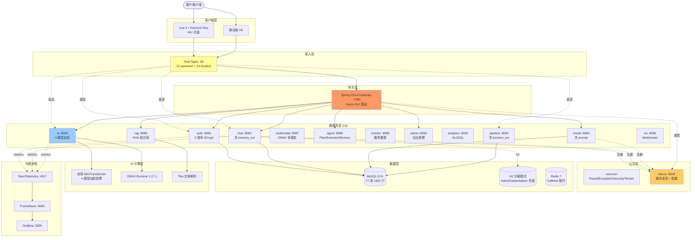
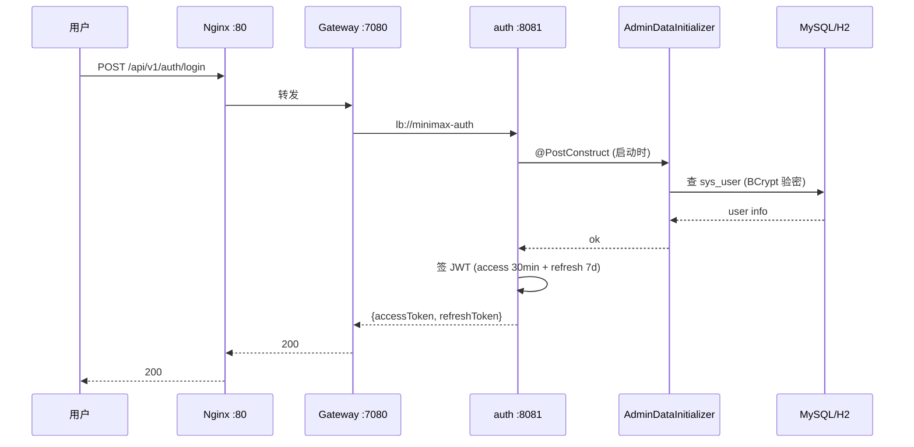
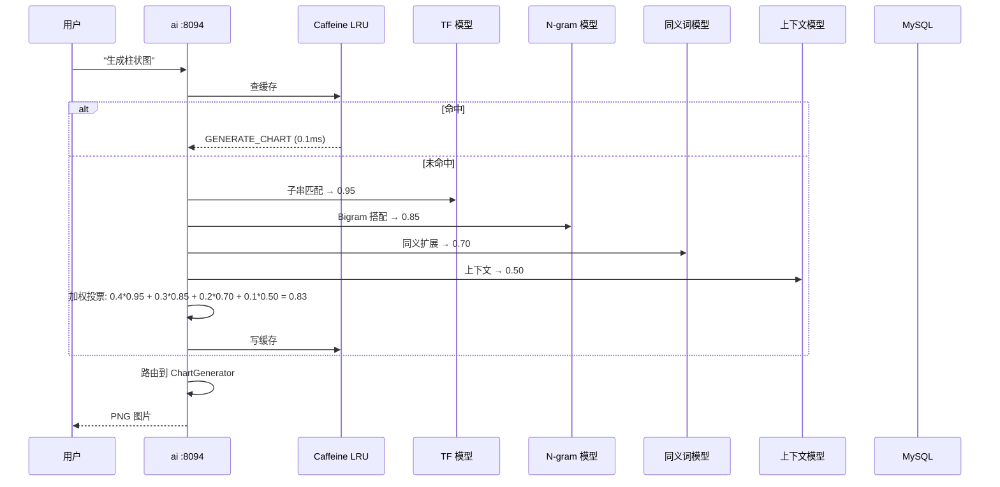
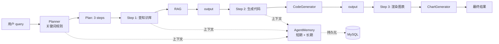
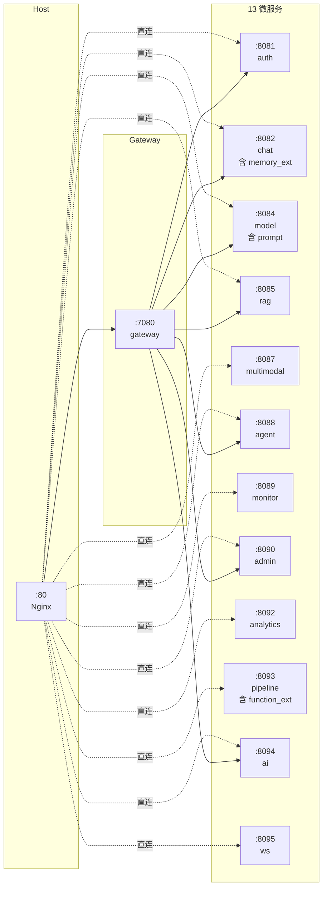
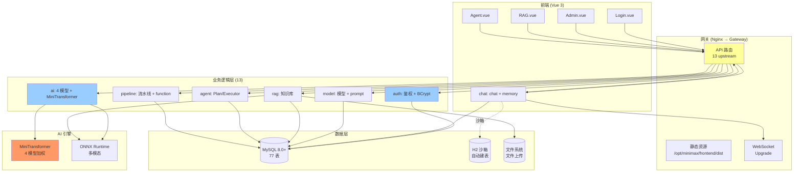
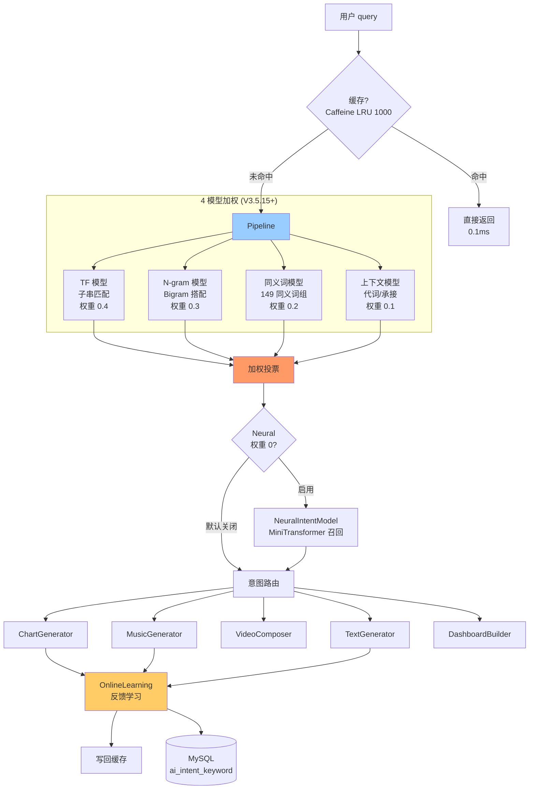
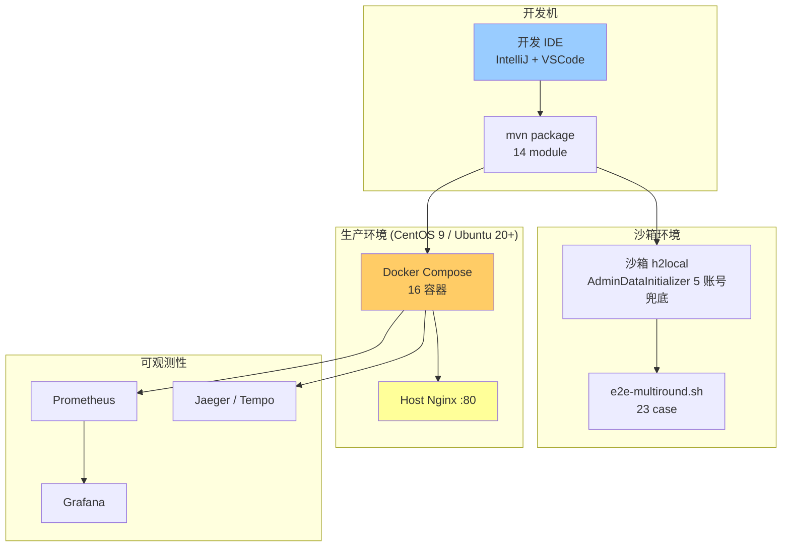

# MiniMax Platform V3.5.21 架构图 (增量)

> V3.5.18 合并 16→13 微服务 + V3.5.19 SQL 重生 + V3.5.20 一致性 + V3.5.21 文档
> 完整架构见 `docs/ARCHITECTURE.md`, 本文档是 V3.5.21 增量

## 一、整体架构 (V3.5.21)

## 二、微服务调用链 (V3.5.21)

### 2.1 用户登录流程

### 2.2 AI 意图识别流程 (V3.5.15+ 4 模型加权)

### 2.3 Agent 编排 (V3.5.16+ Planner/Executor/Memory)

## 三、端口与模块映射 (V3.5.20 100% 一致)

## 四、数据流 (V3.5.21 一致性)

## 五、AI 算法架构 (V3.5.16+)

## 六、部署架构 (V3.5.21)

